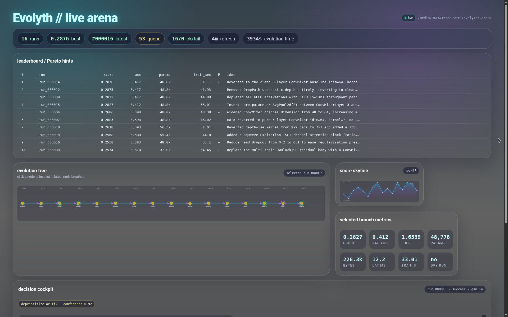
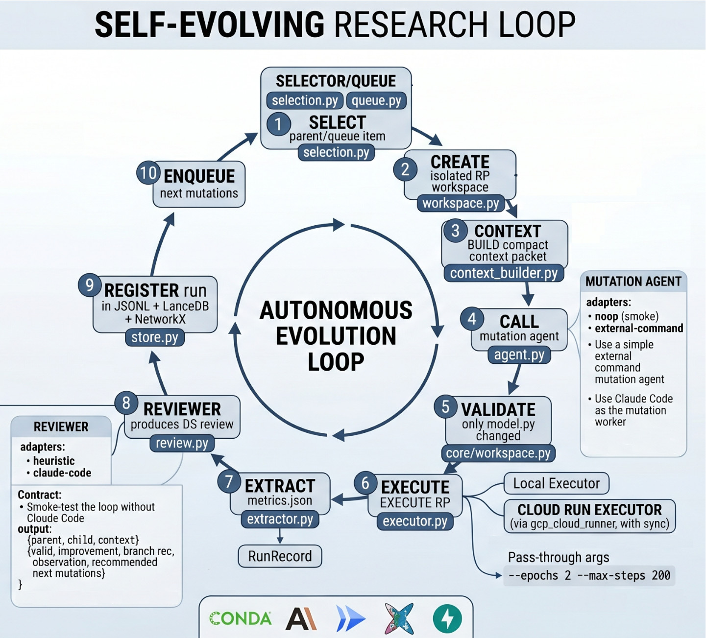
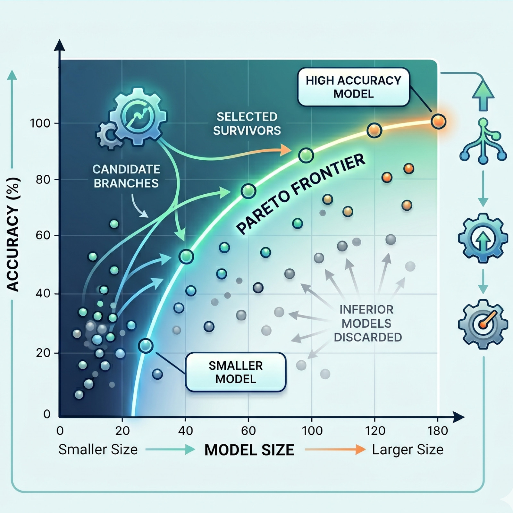

<p align="center">
  
</p>

<h1 align="center">Evolyth</h1>

<p align="center">
  <strong>Autonomous, inspectable AI R&amp;D for model architecture evolution.</strong>

<p align="center">
 <a></a>
 <a></a>
 <a></a>
 <a></a>
 <a></a>

</p>


<p align="center">
  Evolyth turns a machine-learning research problem into evolutionary loop:
  propose a mutation, run the experiment, review the result, preserve the evidence, and queue the next best move.
</p>

<p align="center">
  <a href="#quickstart">Quickstart</a> ·
  <a href="#why-evolyth-exists">Why</a> ·
  <a href="#how-it-works">How it works</a> ·
  <a href="#research-problem-contract">RP contract</a> ·
  <a href="#cloud-gpu-execution">Cloud GPU</a> ·
  <a href="#live-dashboard">Dashboard</a>
</p>

---

## [Why Evolyth exists](#why-evolyth-exists)

Modern AI coding agents can write surprisingly good experimental code. The missing piece is not code generation; it is **scientific discipline**.

A model-improvement loop becomes useful only when each step is:

- **bounded**: the agent can change the experiment, but only inside an explicit research-problem boundary;
- **measured**: every candidate is executed and reduced to comparable metrics;
- **auditable**: the exact model, context, stdout/stderr, metrics, review, and next hypotheses are preserved;
- **resumable**: failures do not erase progress, and the next mutation queue remains durable;
- **portable**: the same loop can run on a laptop for smoke tests or on a GPU-backed cloud runner for real training.

Evolyth is a compact implementation of that idea. It is designed for model architecture research, but the architecture is intentionally generic: any project that can expose a small filesystem contract can be evolved.

## The technical story

Evolyth treats AI-assisted research as an **orchestrated experiment graph**, not a chat session.

A human writes a Research Problem (RP): the goal, the training/evaluation script, and the mutable model file. Evolyth then creates isolated workspaces for each run, asks a mutation worker to make one bounded change, executes the result, extracts metrics, asks a reviewer to interpret what happened, stores the full artifact trail, and uses that evidence to choose the next step.

The key design decision is that the AI agent is **not the system of record**. The arena is. Agents are replaceable workers. The arena keeps the history, leaderboard, Pareto front, queue, lineage, and artifacts.

That makes Evolyth closer to a small autonomous lab notebook than to a one-shot code generator.

---

## Diagram 1 — System architecture

<p align="center">
  
</p>

<p align="center"><em>Diagram 1: Evolyth separates the research problem, AI workers, executors, artifact store, queue, API, and dashboard.</em></p>

The architecture has four layers:

1. **Research Problem boundary** — the RP folder defines what the system is allowed to see and mutate.
2. **Orchestration core** — parent selection, workspace creation, mutation, execution, extraction, review, queueing, and registration.
3. **Execution backends** — local subprocess execution for quick iteration, and Cloud Run GPU execution for real experiments.
4. **Observability surfaces** — CLI, JSONL artifacts, leaderboard, Pareto front, API, and live dashboard.

This separation is the reason the loop stays debuggable. A failed reviewer does not invalidate a completed training run. A failed training run still produces artifacts. A noisy agent can be replaced without changing the executor or store.

---

## Diagram 2 — Evolution loop

<p align="center">
  
</p>

<p align="center"><em>Diagram 2: Pareto frontier.</em></p>

At a high level, one `evolve` step is:

```text
select parent or queued mutation
→ create isolated workspace
→ build compact context packet
→ ask mutation agent for one bounded edit
→ validate allowed file changes
→ execute the research problem
→ extract metrics into a run record
→ review parent vs child
→ snapshot artifacts and register the run
→ enqueue recommended next mutations
```

The loop is deliberately conservative. Evolyth is not trying to let an agent rewrite an entire repository. It is trying to produce **many small, comparable, evidence-backed experiments**.

---

## What Evolyth gives you

### Autonomous model R&D

Run a multi-step architecture search loop where a coding agent proposes changes, the executor tests them, and a reviewer decides whether to continue, branch, or abandon an idea.

### A durable experiment arena

Each run is preserved under `.arena/runs/<run_id>/` with the model snapshot, metrics, events, stdout/stderr, manifest, mutation metadata, reviewer notes, and context.

### Pluggable AI workers

Use Claude Code, a custom external command, or a no-op agent. The mutation and review interfaces are JSON contracts, so you can plug in other LLMs or deterministic tools.

### Local and cloud execution

Start with local smoke tests. Switch to Google Cloud Run GPU jobs with the same `run` and `evolve` commands when experiments need acceleration.

### Live UI and API

Use the NiceGUI dashboard to watch the arena evolve, or query the small API for leaderboards, Pareto front, queue state, lineage, and search.

---

## [Quickstart](#quickstart)

### 1. Clone and install

```bash
git clone https://github.com/akaliutau/evolyth
cd evolyth

conda create -n evolyth python=3.12 -y
conda activate evolyth

pip install -r requirements.txt
```

Optional dashboard dependency:

```bash
pip install nicegui
```

### 2. Configure Claude Code, if using Claude workers

```bash
curl -fsSL https://claude.ai/install.sh | bash
```

Then configure key with either a `.env` file or the Claude CLI:

```bash
claude config set apiKey "sk-ant-..."
```

You can also run the loop without Claude using the no-op or heuristic modes shown below.

### 3. Initialize an arena

```bash
python cli.py --arena .arena init --rp examples/tiny_rp
```

### 4. Run one baseline

```bash
python cli.py --arena .arena run \
  --rp examples/tiny_rp \
  --smoke \
  --mutation-type baseline \
  --mutation-summary "initial smoke baseline"
```

### 5. Inspect results

```bash
python cli.py --arena .arena leaderboard
python cli.py --arena .arena pareto
python cli.py --arena .arena context --rp examples/tiny_rp
```

### 6. Run autonomous evolution

Smoke-test the full loop without Claude:

```bash
python cli.py --arena .arena evolve \
  --rp examples/tiny_rp \
  --steps 2 \
  --agent noop \
  --reviewer heuristic \
  --smoke
```

Run Claude Code as the mutation worker:

```bash
python cli.py --arena .arena evolve \
  --rp examples/tiny_rp \
  --steps 5 \
  --agent claude-code \
  --reviewer heuristic \
  --smoke
```

Run Claude Code for both mutation and review:

```bash
python cli.py --arena .arena evolve \
  --rp examples/tiny_rp \
  --steps 5 \
  --agent claude-code \
  --reviewer claude-code \
  --smoke
```

For full training, remove `--smoke` and pass RP-specific arguments after `--`:

```bash
python cli.py --arena .arena evolve \
  --rp examples/tiny_rp \
  --steps 10 \
  --agent claude-code \
  --reviewer heuristic \
  -- --epochs 2 --max-steps 200
```

---

## [Research Problem contract](#research-problem-contract)

Evolyth's user-facing input is a **Research Problem folder**.

Minimum RP structure:

```text
my_rp/
  goal_prompt.md      # objective and constraints for the model research task
  train_eval.py       # executable training/evaluation entrypoint
  model.py            # mutable model file, edited by the mutation agent
```

By default, the RP command is:

```text
python train_eval.py --dataset synthetic --run-id <run_id>
```

Smoke mode uses:

```text
python train_eval.py --dry-run --dataset synthetic --run-id <run_id>
```

You can override the defaults with `rp_contract.json`.

### Expected outputs

The RP should write metrics and events under the run artifact directory. When the executor launches a run, it sets:

```text
ACR_RUN_ID=<run_id>
ACR_ARTIFACT_DIR=<arena>/runs/<run_id>
PYTHONUNBUFFERED=1
```

A typical run directory looks like this:

```text
.arena/runs/run_000001/
  model.py
  goal_prompt.md
  metrics.json
  events.jsonl
  run_summary.md
  stdout.txt
  stderr.txt
  manifest.json
  context.md
  mutation.json
  ds_review.json
```

This artifact-first contract is what lets Evolyth recover from partial failures and inspect every experiment after the fact.

---

## [Autonomous loop in detail](#how-it-works)

### 1. Parent selection

Evolyth chooses a parent from the run store or consumes a queued mutation idea. The selector balances score, Pareto membership, exploration pressure, run status, and generation depth.

### 2. Isolated workspace

Each candidate gets a fresh workspace copied from the RP and, when relevant, the parent model. This avoids cross-run contamination.

### 3. Context packet

The system builds a compact context packet from the research goal, current model, parent metrics, leaderboard, queue, and prior beliefs. The mutation worker receives enough context to make a targeted edit without seeing unrelated repository state.

### 4. Mutation

The mutation agent is asked for one bounded change. In the default safety mode, only the configured mutable file is allowed to change.

### 5. Execution

The candidate is executed locally or in Cloud Run. The executor captures stdout, stderr, metrics, and artifacts.

### 6. Extraction

Metrics are converted into a normalized run record: status, score, accuracy, loss, parameters, model size, latency, mutation summary, parent id, and generation.

### 7. Review

A heuristic or LLM reviewer compares the child to its parent and writes a data-scientist-style review: whether the mutation was valid, whether it improved the branch, what was learned, and which mutations should be tried next.

### 8. Registration and queueing

The run is registered in the arena, lineage is updated, the leaderboard and Pareto front become queryable, and new mutation ideas are added to the durable queue.

---

## Live dashboard

Start the dashboard:

```bash
python cli.py --arena .arena demo-ui --port 8080
```

The dashboard is intentionally read-only. It polls the arena files and visualizes the experiment graph without becoming another source of truth.

It shows:

- branch constellation with parent-child edges;
- latest run pulse, best-run highlight, and Pareto orbit;
- best score, run counts, queue state, and failure state;
- score skyline over time;
- selected run metrics such as accuracy, loss, params, bytes, latency, train time, dry-run status, AI cost, and evolution time;
- reviewer cockpit with recommendation, confidence, observation, next belief, and suggested mutations;
- leaderboard, queue, and agent/executor/reviewer event stream.

---

## Cloud GPU execution

Evolyth can execute the same RP through Google Cloud Run jobs by using the `cloud-run` executor.

```bash
python cli.py --arena .arena evolve \
  --rp /path/to/tiny-cifar \
  --steps 5 \
  --agent claude-code \
  --reviewer heuristic \
  --executor cloud-run \
  --cloud-spec /path/to/tiny-cifar/cloud_runner.yaml \
  -- --dataset cifar10 --epochs 2 --max-steps 200
```

The Cloud Run executor calls `gcp_cloud_runner/application_cloud_runner.py`, passes the Evolyth run id through to the cloud job, appends RP arguments to the configured runtime command, and syncs outputs back into `.arena/runs/<run_id>/`.

### Why the cloud runner is built this way

The cloud runner separates **image deployment** from **per-run source execution**.

- The reusable runner image is built only when the base image or Python dependencies change.
- Each experiment packs selected source files from the RP, uploads them to GCS, and starts a fresh Cloud Run job.
- The job downloads the source bundle and optional dataset, runs the configured command, uploads artifacts, and syncs them locally.
- The source bundle and job can be cleaned up automatically after successful runs.

This keeps experiment launches fast while preserving a clean, reproducible execution boundary.

### Example `cloud_runner.yaml`

```yaml
name: torch-train
project_id: ${PROJECT_ID}
region: ${REGION}
bucket: ${BUCKET_NAME}
artifact_repo: ${AR_REPO}
service_account: ${SA_EMAIL}

image:
  name: acr-torch-runner
  tag: latest

build:
  base_image: pytorch/pytorch:2.3.1-cuda12.1-cudnn8-runtime
  requirements: requirements.txt

files:
  include: ["train.py", "src/**", "configs/**", "requirements.txt"]
  required: ["train.py"]
  exclude: ["data/**", "artifacts/**", "checkpoints/**", "*.pt", "*.pth"]
  hashes: {}

source:
  gcs_prefix: gs://${BUCKET_NAME}/acr-sources/torch-train

runtime:
  command: ["python", "train.py"]
  workdir: /workspace/app

dataset:
  uri: gs://${BUCKET_NAME}/datasets/example-dataset/data.tar.gz
  container_dir: /workspace/dataset
  mode: auto
  unpack: auto

cloud_run:
  gpu: 1
  gpu_type: nvidia-l4
  cpu: 4
  memory: 16Gi
  task_timeout: 3600s

artifacts:
  container_dir: /workspace/artifacts
  gcs_prefix: gs://${BUCKET_NAME}/training-runs/torch-train
```

---

## External worker contracts

Evolyth can use any mutation or review tool that speaks JSON over stdin/stdout.

### Mutation worker input

```json
{
  "rp_path": ".../.arena/workspaces/run_000001",
  "mutable_file": "model.py",
  "context": "compact evolution context",
  "current_model": "full model.py contents"
}
```

### Mutation worker output

The worker may edit the workspace directly or return a complete replacement for `model.py`.

```json
{
  "mutation_type": "safe_refinement",
  "mutation_summary": "one sentence",
  "hypothesis": "why this should help",
  "changed_files": ["model.py"],
  "model_py": "full replacement contents, optional"
}
```

### Review worker input

```json
{
  "parent": {},
  "child": {},
  "context": "..."
}
```

### Review worker output

```json
{
  "valid": true,
  "is_improvement": true,
  "branch_recommendation": "continue",
  "observation": "what happened",
  "next_belief": "what this suggests",
  "recommended_next_mutations": [
    {
      "mutation_type": "safe_refinement",
      "description": "bounded next idea",
      "expected_benefit": "why",
      "priority": 0.7
    }
  ]
}
```

This contract makes the AI layer replaceable. Claude Code is one adapter, not a hard dependency of the architecture.

---

## CLI reference

```bash
# Validate an RP and initialize arena state
python cli.py --arena .arena init --rp examples/tiny_rp

# Execute and register one run
python cli.py --arena .arena run --rp examples/tiny_rp --smoke

# Run autonomous evolution
python cli.py --arena .arena evolve --rp examples/tiny_rp --steps 5 --agent claude-code --reviewer heuristic

# List queued mutation ideas
python cli.py --arena .arena queue

# Show best runs
python cli.py --arena .arena leaderboard

# Show Pareto front
python cli.py --arena .arena pareto

# Print context packet for a parent
python cli.py --arena .arena context --rp examples/tiny_rp --parent-id run_000001

# Search prior runs
python cli.py --arena .arena search depthwise

# Serve API
python cli.py --arena .arena serve --port 8000

# Serve dashboard
python cli.py --arena .arena demo-ui --port 8080
```

---

## API

Start the API:

```bash
python cli.py --arena .arena serve --port 8000
```

Endpoints:

```text
GET  /leaderboard
GET  /pareto
GET  /queue
GET  /runs/{run_id}
GET  /runs/{run_id}/lineage
GET  /search?q=depthwise
POST /runs/register
```

---

## Repository map

```text
cli.py                    command-line entry point
core/rp.py                Research Problem contract loader
core/workspace.py         isolated workspaces + single-file validation
core/agent.py             MutationAgent, Claude Code, external command, no-op adapters
core/orchestrator.py      select → mutate → execute → review → queue loop
core/executor.py          Executor interface, LocalExecutor, CloudRunExecutor
core/store.py             run registry, leaderboard, lineage, search storage
core/run_store.py         filesystem artifact snapshots and manifests
core/extractor.py         metrics.json → RunRecord
core/pareto.py            Pareto front utilities
core/context_builder.py   compact context packet builder
core/selection.py         parent-priority heuristic
core/queue.py             durable priority queue for mutation ideas
core/review.py            reviewer interface and adapters
core/api.py               FastAPI wrapper
core/ui_demo.py           read-only NiceGUI dashboard

gcp_cloud_runner/         reusable Cloud Run GPU job runner
examples/                 sample RPs and agent integrations
```

---

## Design principles

### 1. The arena is the memory

LLM context is transient. The arena is persistent. Every run is preserved as data and artifacts so the system can resume, inspect, and branch.

### 2. Agents are workers, not authorities

Mutation and review agents can be Claude Code, external commands, or deterministic heuristics. Their outputs are recorded, but the orchestrator owns the lifecycle.

### 3. Small mutations beat heroic rewrites

A good autonomous research loop needs comparable deltas. Evolyth encourages one bounded mutation per run and validates allowed file changes by default.

### 4. Execution is the judge

The training/evaluation script is the objective source of truth. The reviewer can interpret results, but metrics determine the run record.

### 5. Failures are data

A failed run, timeout, parse error, or inconclusive review should leave artifacts behind. In autonomous R&D, reliability comes from preserving partial evidence, not pretending every step succeeds.

---

## When to use Evolyth

Evolyth is a good fit when you have:

- a model architecture or training pipeline with a clear evaluation script;
- a score function that can compare candidates;
- a narrow file or module that can be safely mutated;
- enough experiment budget to test many small variants;
- a need to inspect why one branch improved or regressed.

Useful to generate and triage candidates, then rerun promising results under stricter experimental controls.

---

## Roadmap ideas

- richer cost accounting for coding, review, and cloud compute;
- first-class experiment budgets and stopping criteria;
- stronger lineage visualization and branch comparison;
- pluggable multi-objective scoring policies;
- replay mode for deterministic audits;
- distributed queue workers;
- native support for more cloud/GPU backends;
- benchmark packs for common model-search tasks.

---

## Contributing

Contributions are welcome, especially around:

- new executor backends;
- additional reviewer strategies;
- stronger safety validation for mutable files;
- better dashboard views;
- example Research Problems;
- reproducibility and experiment-analysis tooling.

Before opening a large PR, start with an issue describing the research workflow or reliability problem you want to improve.

---

## ⚖️ License

Project Aethelgard is open-source software distributed under the **MIT License**. 

By keeping the core routing and security protocol open and accessible, we aim to lower the barrier to entry for underfunded 
rural clinics and state-scale hospital networks alike. See the [LICENSE](LICENSE) file for more details.

---

*Built exclusively for the Claude Code hackathon organized by Anthropic.* <br>
*Evolyth - The Engine of Discovery.*


